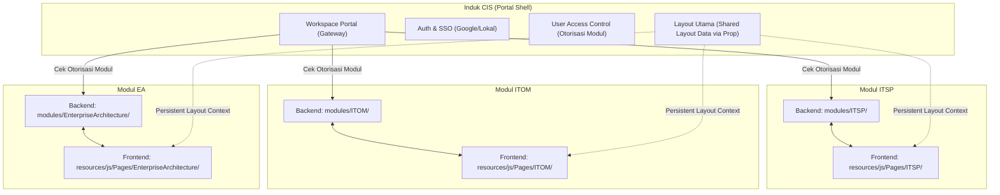

---
name: modular-mvc-system
description: Guidelines for managing and structuring the modular MVC system (backend and frontend) in this Laravel + Inertia.js workspace using pre-existing databases (no migrations).
---

# Modular MVC System Guidelines (No-Migration Standard)

Dokumen ini mendefinisikan konvensi, arsitektur, dan struktur folder untuk sistem modular MVC menggunakan **Laravel + Inertia.js**. Standar ini dirancang khusus untuk lingkungan yang **tidak menggunakan Laravel Migrations** (database sudah dibuat/dikelola secara manual langsung di DBMS), dengan tetap memastikan setiap modul bersifat **self-contained, portable, dan 100% decoupled**.

Dengan standar ini, modul (seperti **ITSP**, **ITOM**, **EA**, dll.) dapat dikembangkan di repository terpisah dan disalin secara penuh ke repository utama dengan penyesuaian minimal.

---

## 🏛️ Arsitektur Induk CIS (Collaboration Information System)

Aplikasi CIS bertindak sebagai **induk (portal shell)** yang mengelola otentikasi (SSO Google/Lokal), otorisasi (hak akses modul), tata letak global (sidebar/navbar), dan koneksi ke master data bersama. Sub-modul terintegrasi ke dalam induk sebagai plugin independen.

### Visualisasi Hubungan Induk & Modul



### Struktur Tree Direktori Projek

Berikut adalah struktur direktori lengkap yang menunjukkan pemisahan antara core induk CIS dengan sub-modul:

```text
(CIS Codebase)
├── app/                         # CORE INDUK: Logika global portal shell
│   ├── Http/
│   │   ├── Controllers/         # Controller portal (Auth, Admin, Workspace)
│   │   └── Middleware/          # Middleware global (HandleInertiaRequests, Auth)
│   └── Models/                  # Model database inti/shared (User, UserModule, Coe, TrsOrganization)
├── bootstrap/
│   ├── app.php                  # Konfigurasi bootstrap & Middleware global
│   └── providers.php            # Tempat mendaftarkan Service Provider Induk & Modul 
├── config/                      # Konfigurasi sistem global
├── database/                    # [TIDAK DIGUNAKAN UNTUK MODUL] Hanya jika ada seeder/migration core induk
├── modules/                     # 🔌 INTEGRASI BACKEND (Self-Contained Modules)
│   ├── ITSP/                    # Modul IT Strategic Planning
│   │   ├── Controllers/
│   │   ├── Models/
│   │   ├── Providers/           # Tempat ITSPServiceProvider.php
│   │   ├── Services/
│   │   └── Routes/
│   └── ITOM/                    # Modul IT Operating Model
│       ├── Controllers/
│       ├── Models/
│       ├── Providers/           # Tempat ITOMServiceProvider.php
│       ├── Services/
│       └── Routes/
├── resources/
│   └── js/
│       ├── Layouts/             # Layout global portal (UserLayout.vue)
│       └── Pages/               # 🔌 INTEGRASI FRONTEND (Inertia Pages)
│           ├── Auth/            # Halaman Login/Register Induk
│           ├── Workspace/       # Landing page portal
│           ├── ITSP/            # Folder frontend ITSP (Nama wajib match dengan Backend)
│           └── ITOM/            # Folder frontend ITOM (Nama wajib match dengan Backend)
└── routes/
    └── web.php                  # Routing core induk
```

---

## 📂 Folder Structures (Per-Modul)

Untuk menjaga portabilitas, seluruh komponen milik modul harus berada di bawah satu folder backend dan satu folder frontend dengan aturan penamaan yang identik (case-sensitive).

### 1. Backend Module Structure (`modules/<ModuleName>/`)

Karena schema database dikelola manual langsung di DBMS, folder `Database/Migrations` ditiadakan. Modul hanya membawa logika aplikasi, model data, seeder (jika butuh populate data awal), dan routing.

```text
modules/<ModuleName>/
├── Controllers/              # Controller spesifik modul
│   ├── SubFolder/            # Sub-groups fitur (contoh: Policy/, Dashboard/)
│   └── HomeController.php
├── Models/                   # [MANDATORI] Mapping tabel database yang sudah ada
│   ├── ModelName.php         # Model data dengan table binding eksplisit
│   └── AnotherModel.php
├── Providers/                # Service Providers untuk inisialisasi modul
│   └── <ModuleName>ServiceProvider.php
├── Routes/                   # Route internal modul (web dan api)
│   ├── web.php
│   └── api.php
├── Services/                 # Services internal modul
│   ├── SubFolder/            # Sub-groups fitur (contoh: Policy/, Dashboard/)
│   └── ServiceName.php
├── Database/
│   └── Seeders/              # [Opsional] Seeder untuk mengisi data awal ke tabel yang sudah ada
│       └── <ModuleName>Seeder.php
└── Config/                   # [Opsional] Konfigurasi lokal modul
    └── config.php
```

#### Penjelasan Lengkap Folder Backend:
*   **`Controllers/`**: Controller diletakkan di sini. Direkomendasikan dikelompokkan dalam subfolder jika modul memiliki banyak fitur (contoh: `Controllers/Policy/ProcedureController.php`).
*   **`Models/`**: Model data wajib disimpan di sini dengan namespace `Modules\<ModuleName>\Models`. Karena database dikelola manual, setiap model **wajib** mendefinisikan:
    *   `protected $table`: Nama tabel database secara eksplisit.
    *   `protected $primaryKey`: Nama primary key jika bukan `id`.
    *   `public $incrementing`: Set ke `false` jika primary key bukan auto-increment.
    *   `protected $fillable`: Array kolom yang dapat diisi.
*   **`Providers/`**: Berisi `<ModuleName>ServiceProvider.php`. Ini adalah jantung modul untuk memuat routing tanpa mengedit file routes global di induk.
*   **`Routes/`**: Berisi `web.php` dan `api.php`. Route harus dibungkus dengan route group, prefix, dan name prefix agar terstruktur.

#### Kode Standar Service Provider Modul:

```php
<?php

namespace Modules\<ModuleName>\Providers;

use Illuminate\Support\ServiceProvider;
use Illuminate\Support\Facades\Route;
use Illuminate\Support\Str;

class <ModuleName>ServiceProvider extends ServiceProvider
{
    /**
     * Register services.
     */
    public function register(): void
    {
        // Register konfigurasi lokal jika dibutuhkan
    }

    /**
     * Bootstrap services.
     */
    public function boot(): void
    {
        // Dapatkan nama modul berformat lowercase untuk prefix otomatis (contoh: "itsp" atau "itom")
        $moduleName = Str::lower(basename(dirname(__DIR__)));

        // Load Web Routes secara otomatis dengan enkapsulasi penuh
        if (file_exists(__DIR__ . '/../Routes/web.php')) {
            Route::middleware(['web', 'auth'])
                ->prefix($moduleName)
                ->name($moduleName . '.')
                ->group(__DIR__ . '/../Routes/web.php');
        }

        // Load API Routes secara otomatis
        if (file_exists(__DIR__ . '/../Routes/api.php')) {
            Route::middleware(['api', 'auth:api'])
                ->prefix('api/' . $moduleName)
                ->name('api.' . $moduleName . '.')
                ->group(__DIR__ . '/../Routes/api.php');
        }
    }
}
```

---

### 2. Frontend Structure (`resources/js/Pages/<ModuleName>/`)

Struktur folder frontend di bawah `resources/js/Pages/` harus mencerminkan pembagian modul pada backend untuk menjaga kerapian.

```text
resources/js/Pages/<ModuleName>/
├── Components/               # Komponen Vue re-usable yang hanya dipakai internal modul
│   ├── ModuleSidebar.vue     # Navigasi khusus modul
│   └── DataMetricCard.vue    # Widget metric data
├── SubFeatureA/              # Sub-fitur yang merepresentasikan group routing backend
│   ├── Index.vue             # Renders via: Inertia::render('<ModuleName>/SubFeatureA/Index')
│   └── Show.vue
└── SubFeatureB/
    └── Index.vue
```

#### Penjelasan Lengkap Folder Frontend:
*   **`Components/`**: Simpan komponen Vue kecil yang digunakan berulang kali di dalam halaman modul Anda. Ini memastikan komponen tersebut tidak tercampur dengan komponen global di `resources/js/Components/`.
*   **`SubFeature/`**: Setiap folder merepresentasikan satu modul fitur (contoh: `Policy/`, `Procedure/`). Hal ini mempermudah pencarian file yang berkaitan dengan menu tertentu di aplikasi.
*   **Persistent Layouts**: Halaman modul dilarang meng-import langsung file layout induk dengan path relatif (contoh salah: `import Layout from '../../Layouts/UserLayout.vue'`). Gunakan pembungkus layout berbasis Inertia (via app.js resolver atau Shorthand Layout property), agar halaman modul tidak pecah saat disalin ke repositori dengan struktur layout berbeda.
*   **Scoped Styles**: Semua sintaks CSS wajib menggunakan tag `<style scoped>` di dalam file Vue untuk mencegah kebocoran visual (*style leakage*).

---

## 🔄 How to Copy a Module Between Repositories

Langkah-langkah menyalin modul secara utuh dari repositori asal ke repositori target:

1.  **Copy Backend**: Salin folder `source_project/modules/<ModuleName>` ➡️ `target_project/modules/<ModuleName>`.
2.  **Copy Frontend**: Salin folder `source_project/resources/js/Pages/<ModuleName>` ➡️ `target_project/resources/js/Pages/<ModuleName>`.
3.  **Daftarkan Service Provider**: Buka file `bootstrap/providers.php` pada target project dan daftarkan service provider modul:
    ```php
    return [
        App\Providers\AppServiceProvider::class,
        // ...
        Modules\<ModuleName>\Providers\<ModuleName>ServiceProvider::class, // 👈 Tambahkan baris ini
    ];
    ```
4.  **Refresh Autoload**: Buka terminal di direktori target project dan jalankan perintah:
    ```bash
    composer dump-autoload
    ```
    *(Pada lingkungan Mac dengan setup lokal khusus, gunakan: `/opt/homebrew/bin/php composer.phar dump-autoload`)*
5.  **Database Seeding (Jika Ada)**: Jika ada data awal yang perlu dimasukkan ke dalam database yang sudah ada, jalankan seeder modul:
    ```bash
    php artisan db:seed --class=\Modules\<ModuleName>\Database\Seeders\<ModuleName>Seeder
    ```

---

## 🛠️ Best Practices for Code Portability

Untuk menjaga agar modul mudah dipindahkan, ikuti aturan coding berikut:

1.  **Gunakan Route Name**: Jangan pernah menuliskan URL secara hardcoded di dalam Controller maupun Vue Pages. Gunakan route name Laravel.
    *   *Controller*: `return redirect()->route('itom.policy.index');`
    *   *Vue Link*: `<Link :href="route('itom.policy.index')">`
2.  **Explicit Relationship Namespace**: Saat menuliskan relasi Eloquent di dalam Model modular, gunakan namespace lengkap untuk class target.
    *   *Relasi sesama modul*: `return $this->belongsTo(MstRegulation::class);` (Karena berada di namespace yang sama).
    *   *Relasi ke modul lain / shared*: `return $this->belongsTo(\App\Models\TrsOrganization::class, 'pic_id');`

---

## 🚫 DO & DON'T (AI Guidelines)

Adukan aturan ini untuk mencegah halusinasi kode atau kesalahan arsitektur:

### ✅ DO (Lakukan):
*   **Wajib Explicit Table**: Selalu definisikan `protected $table = 'nama_tabel';` pada setiap model yang dibuat atau dipindahkan.
*   **Import Sesuai Namespace Baru**: Saat memindahkan model ke modul, perbarui semua kode yang memanggil model tersebut ke namespace baru (contoh: `use Modules\ITOM\Models\MstRegulation;` bukan `use App\Models\MstRegulation;`).
*   **Gunakan Fully Qualified Name untuk Core Shared**: Untuk relasi model modul ke model core induk (seperti `User`, `TrsOrganization`, dll.), import dengan namespace aslinya (contoh: `\App\Models\User::class`).
*   **Gunakan `<style scoped>`**: Selalu tambahkan properti `scoped` di Vue `<style>` untuk menjaga kestabilan interface.

### ❌ DON'T (Jangan Lakukan):
*   **DILARANG membuat Folder `Migrations`**: Jangan pernah membuat folder `Database/Migrations` atau file migration di dalam modul baru. Skema database dikelola manual langsung pada database server.
*   **DILARANG memanggil `$this->loadMigrationsFrom()`**: Di dalam ServiceProvider modul, dilarang memanggil method load migrations karena migrasi modular ditiadakan.
*   **DILARANG meng-import Layout Induk dengan Path Relatif**: Jangan menulis `import ... from '../../Layouts/UserLayout.vue'` di halaman modul.
*   **DILARANG memindahkan Core Shared Models**: Jangan memindahkan model yang dipakai bersama oleh banyak modul (seperti `TrsOrganization`, `MstObjective`, `MstFunction`) ke dalam satu modul spesifik. Biarkan model-model tersebut tetap berada di `App\Models/`.
